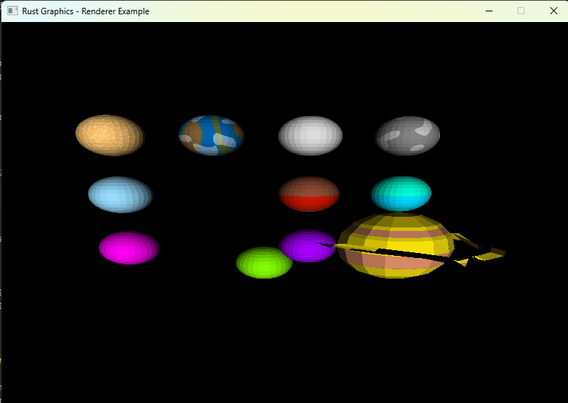

# Laboratorio4-GraficasXComputadoras

Lab 4: Shaders

``git clone https://github.com/BrandonReyes0609/Laboratorio4-GraficasXComputadoras.git``

``cd Laboratorio4-GraficasXComputadoras``

## Códigos importantes

``cargo run``

``cargo build --release``

``./target/release/codigo``

## Códigos importantes repositorio-githusb

1. Crear la nueva rama

``git checkout -b NRAMA``

2. Añadir todos los archivos

``git add .``

3. Realizar el commit

``git commit -m "mcambios NRAMA"``

4. Subir la nueva rama al repositorio remoto

``git push origin NRAMA``

